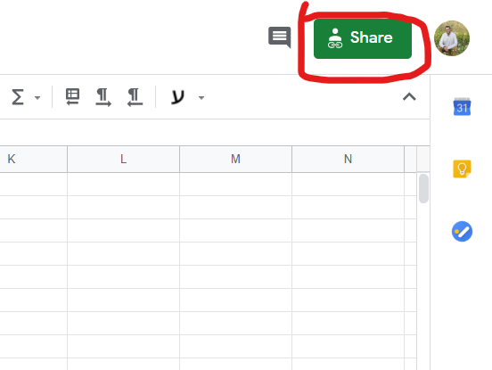
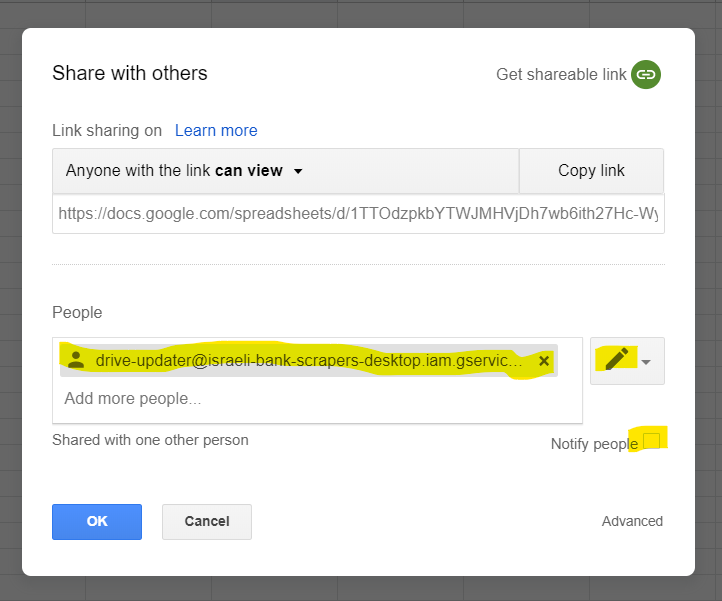
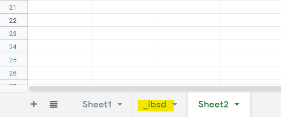

# Share a Google-Spreadsheet with iseali-bank-scrapers-desktop

1. [Create a Google Spreadsheet](https://docs.google.com/spreadsheets/create).

2. Click on the **Share** button:  

3. Add the app's email address- drive-updater@israeli-bank-scrapers-desktop.iam.gserviceaccount.com.  
(This email address doesn't have a mailbox, so don't send emails there).

4. Make sure you give **edit permission**.

5. Unmark **Notify people**.  
(As I said, emails cannot be sent to this address)

6. Your input should look like this:  

7. The document address (from the address bar) can now be shared with the app.  
(To be sure, the address should look like this: `https://docs.google.com/spreadsheets/d/{Document-ID}/{Other-things}`)

Using the app to upload data will create a worksheet called `_ibsd`:

**Don't edit this worksheet!**

The app expects a fixed format to keep this worksheet up to date. If you change it, the app will change the data back, and in the worst case the app will fall.

I recommend that you create a different worksheet, which read the data from the worksheet `_ibsd` and analyze them.
